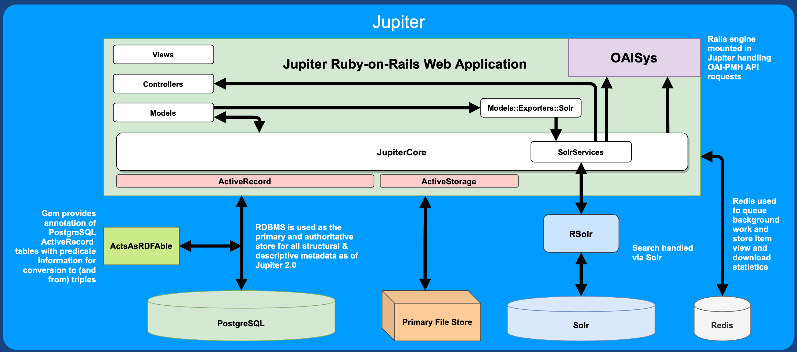

# Jupiter

[](https://travis-ci.org/ualbertalib/jupiter)

# Architecture



**Requirements:**

- **Ruby** 2.5+
- **PostgreSQL**
- **Redis**
- **Solr**
- **ImageMagick**
- **Node.js** 10.13.0+
- **Yarn**

# Generate Documentation

`$ bundle exec rake rdoc`

# View Documentation

`$ open doc/index.html` is the location for docs created by rdoc

`$ open docs/rdoc/index.html` is the location for docs created by rerdoc

# Check your style

`$ bundle exec rubocop`

# Run tests

`$ bundle exec rails test`

# Run system tests
By default, `rails test` will not run the system tests. To run them use:

`$ bundle exec rails test:system`

# Seed your development database

`$ bundle exec rake db:seed`

Please note that by default the seeding process will download community logos
from the web. If you are not on a network, or otherwise wish to prevent this
behaviour, please set the enviroment variable `SKIP_DOWNLOAD_COMMUNITY_LOGOS`.

***Note***: You may need chromedriver and perhaps a few other dependencies installed to run these system tests in selenium.

# REGenerate Documentation

`$ bundle exec rake rerdoc`

# UAT Environment

The UAT server is accessible on all library staff workstation, and through VPN on any external IP address.  More details regarding access and deployment can be found:
[Jupiter UAT Setup](https://github.com/ualbertalib/di_internal/blob/master/System-Adminstration/UAT-Environment.md)

# Docker
This project comes with a docker setup to easily setup your own local development environment for jupiter in just a few steps.

## Step 1: Make sure you have docker, docker-compose, git and Ruby  installed:

1. [Install Docker](https://docs.docker.com/engine/installation/) (Requires version 1.13.0+)
2. [Install Docker Compose](https://docs.docker.com/compose/install/) (Requires version 1.10.0+)
3. Install git
4. Install Ruby (v2.6+)

### Still need more help? Check out the following

#### OSX / Windows
- If you are on Mac, check out [Docker for Mac](https://docs.docker.com/docker-for-mac/)
- If you are on Windows, check out [Docker for Windows](https://docs.docker.com/docker-for-windows/)

These will install `docker`, `docker-compose`, and `docker-machine` on your machine.

#### Linux

Use your distribution's package manager to install `docker` and `docker-compose`.

## Step 2: Get Jupiter source code
Clone the Jupiter repository from github:
```shell
git clone git@github.com:ualbertalib/jupiter.git
cd jupiter
```

## Step 3: Start docker and docker compose

We use docker for provisioning all of our datastores we require for jupiter (solr/postgres/redis)

To start and setup your docker containers simply
```shell
docker-compose -f docker-compose.yml up -d
```

## Step 4: Bundle install project's dependencies

```shell
bundle install
```


## Step 5: Setup Database

```shell
bundle exec rails db:prepare
```


## Step 6: Start the Rails server

```shell
bin/rails s
```

Now everything should be up and running!

## Step 4: Open and view Jupiter!
Now everything is ready, you can go and view Jupiter! Just open your favorite browser and go to the following url:

  - Development environment: [localhost:3000](http://localhost:3000)


## Docker compose demo edition

Want to quickly try out and explore Jupiter? This project comes with a demo docker setup to easily setup your own local development environment for jupiter in just a few steps.


## Step 1: Get Jupiter source code
Clone the Jupiter repository from github:
```shell
git clone git@github.com:ualbertalib/jupiter.git
cd jupiter
```

## Step 2: Start docker and docker compose

To build, create, start and setup your docker containers simply run:
```shell
docker-compose -f docker-compose.demo.yml build
```

```shell
docker-compose -f docker-compose.demo.yml up -d
```

Now everything should be up and running!

## Step 3: Open and view Jupiter!
Now everything is ready, you can go and view Jupiter! Just open your favorite browser and go to the following url:

[localhost:3000](http://localhost:3000)

(Note: ip address may be different if you are using `docker-machine`)

## For production deployment (on UAT environment)
To setup the environment variables needed for deployment, modify the sample .env_deployment file with variable values needed for the deployment:
```shell
cp .env_deployment_sample .env_deployment
vi .env_deployment
```
To build, create, start and setup your docker containers simply run:
```shell
docker-compose -f docker-compose.production.yml up -d
```

For the first time of the deployment, set up the database:
```shell
docker-compose -f docker-compose.production.yml run web rails db:setup
```

## Common gotchas for docker?
- If your having issues, logs are the best place to first look at what went wrong.

  To check all container logs:

  ```shell
  docker-compose logs
  ```

  Better yet you can check an individual container log by supplying the container name to the previous command. For example if I want to see the web container logs:

  ```shell
  docker-compose logs web
  ```
- If your switching between docker-compose and local development on your machine, you may encounter in weird permissions on files that docker has created (/tmp/pids/, etc.). Simply just `sudo rm` them.

- If you would like to run Postgres in a container, but docker-compose reports that port 3306 is already in use, you likely have a Postgres instance already running on the host. You will need to shutdown Postgres before you can start the container. On Ubuntu, `sudo service postgresql stop` on the host will do the trick. Another option is to configure docker and the rails app to look for Postgres using a different port.

# Want to setup Virus-Checking and FITS characterization?

The Clamby repository has [instructions](https://github.com/kobaltz/clamby#dependencies) on setting up clamav on various operating systems

For characterization you need to install [FITS](https://github.com/harvard-lts/fits) and ensure that `fits.sh` is in your Rails' process' PATH
[Hydra-File_Characterization](https://github.com/samvera/hydra-file_characterization), which Hydra-Works leverages, has more information on configuring the characterization setup.

Characterization is turned off by default for the development environment. If you would like to turn it on without
modifying the config files, set the environment variable `RUN_FITS_CHARACTERIZATION`.

# Configuring SAML

* Update `secrets.yml` (and maybe `omniauth.rb`) for the SAML implementation (you may need to generate a certificate/key for certain environments)
* Give IST's Identity Provider (uat-login or login) the metadata for our service provider
  * Quick way to view this metadata is to the start the Rails server and navigate to `http://localhost:3000/auth/saml/metadata` (feel free to edit this metadata accordingly for example adding Organization and ContactPerson metadata)
* Once this is complete, login via SAML should be working successfully. Try it out!

(TODO: Provide an alternatives to IST IdP for non production environments?)


# Batch Ingest

Jupiter comes with a handy rake task for batch ingesting items.

- First you need to provide a csv file which outlines all the items metadata you wish to ingest. An example template for what an expected csv file might look like can can be found [here](https://docs.google.com/spreadsheets/d/178o_-ZEV3Ii-IzJ0AcJQTQqFsH3Ew2WCgyj2aZw99iY/). You can make a copy of this template, fill it out with your items metadata, and then download the first sheet as a CSV file (File > Download as > Comma-seperated values (.csv, current sheet)).

- All associated files for the items outlined in the csv file above must live in the same directory. So as an example if we have downloaded the csv file to `~/Downloads/example-batch-ingest-file.csv`, then any file that was referenced in the csv file, should also live in the `~/Downloads` directory.

- Now we can run the batch ingest on the command line using the following rake task:

  ```shell
  rails jupiter:batch_ingest_items[csv_path]
  ```

  The argument `csv_path` is the location of the csv file. So in the above example, this might look like:

  ```shell
  rails jupiter:batch_ingest_items["~/Downloads/example-batch-ingest-file.csv"]
  ```

  After running the above command, you should have just successfully batch ingested your items into jupiter!
